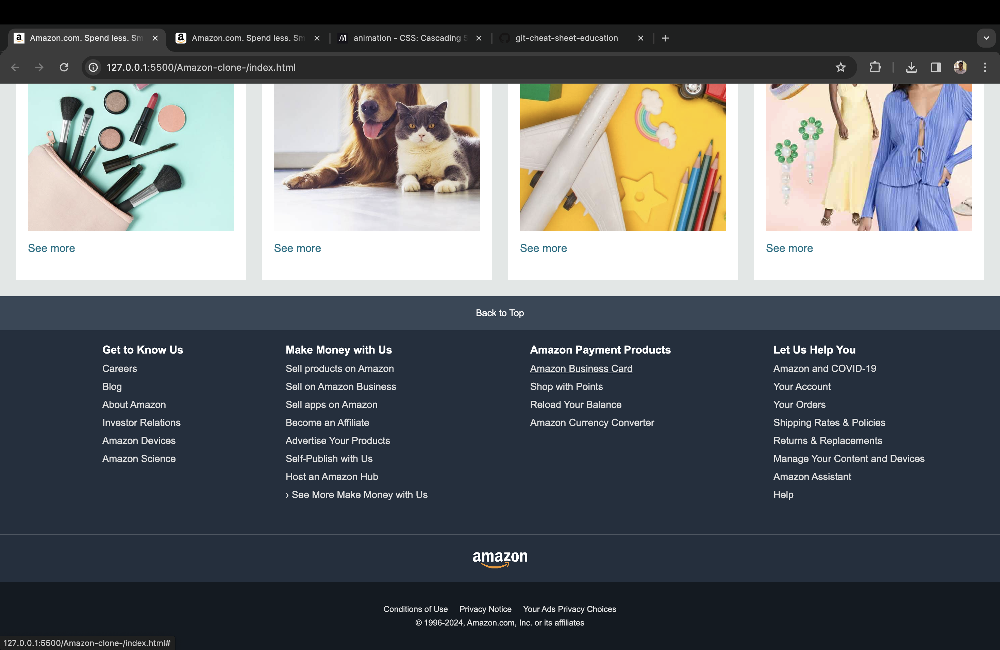

Amazon Clone

This repository contains a clone of the Amazon.com index webpage created using HTML and CSS only. It serves as a demonstration of front-end development skills, showcasing the structure and styling resembling the Amazon website.

Technologies Used

* HTML
* CSS

Preview

 

Instructions

To view the cloned Amazon index webpage:
* Clone this repository to your local machine using git clone https://github.com/Suyash-Dhakal/Amazon-clone-.git
* Open index.html in your preferred web browser.

Feel free to explore and provide feedback!
